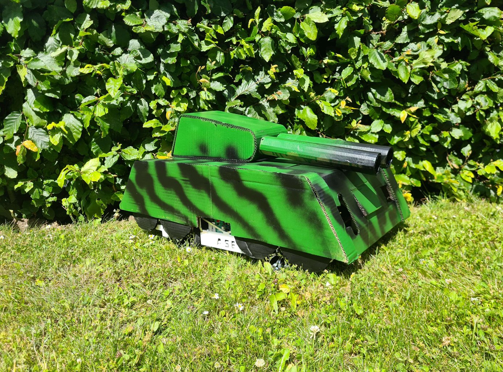
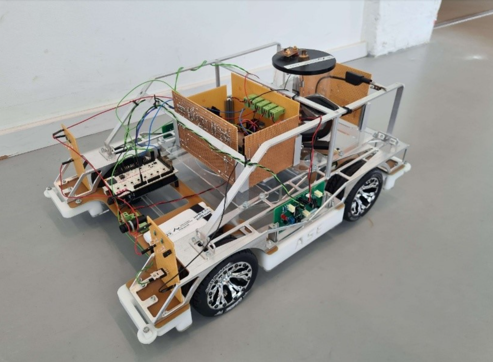
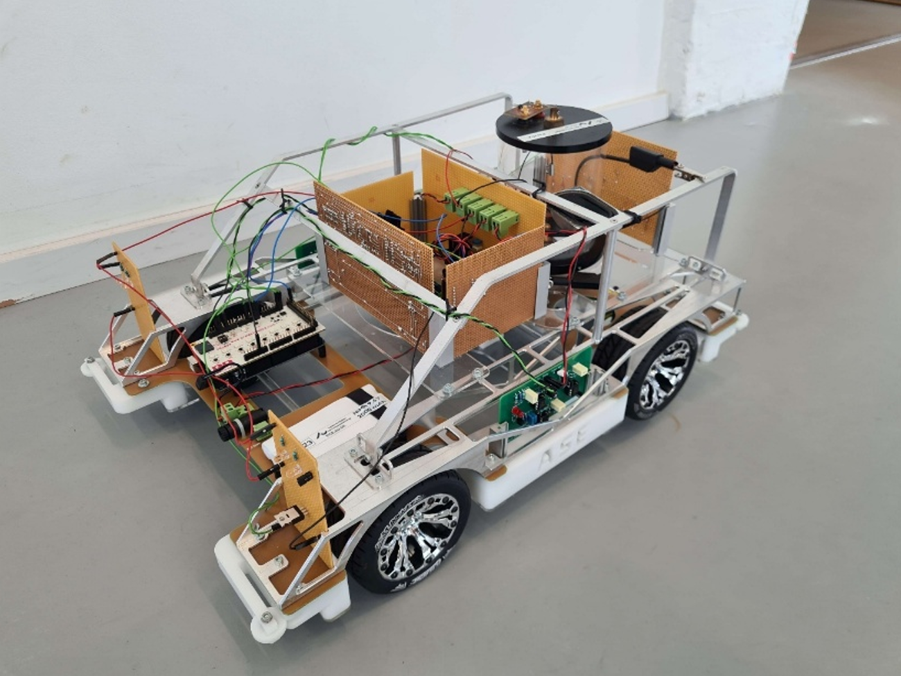

# TANK!

An autonomous, scripted robot car built on a bare-metal ATmega2560, developed as a 1st semester project at Aarhus University. The car drives a fixed course on its own: reflective markers along the track trigger hardware interrupts, and each marker advances a choreographed sequence of motor moves, headlight/tail-light changes and sound effects. The finished vehicle is dressed up with a camouflage tank shell - hence the name.

| The car in action | Chassis & electronics |
|---|---|
|  |  |

---

## How it works

The car is started with a physical switch and then runs entirely on its own. The track is marked with **reflective tiles**; a reflex sensor drives an input high each time the car passes one.

- **Marker detection** - the reflex sensor is wired to two external-interrupt pins (`INT0` / `INT1`), triggered on the rising edge. Each pulse fires an interrupt that advances the run.
- **Hardware debounce** - on every detection the interrupts disable themselves and start a **Timer3 CTC** window (~2 s). When it elapses, a compare-match interrupt clears the pending flags and re-enables detection, so a single marker is never counted twice.
- **Choreographed run** - a `RefleksCount` state machine maps each marker index to a stage of the course: drive forward or reverse, change speed, set the head- and tail-light brightness, and play a matching sound cue. The final marker stops the car and plays the finishing sound.

Everything is written directly against the AVR hardware registers - no Arduino framework - coordinating four peripherals at once:

```
                          ┌──────────────── ATmega2560 ─────────────────┐
   Reflex sensor  ──INT0/INT1──▶  DrivingControl (RefleksCount state machine)
   (track markers)   rising edge  │   ├── Timer3 CTC ~2 s  → interrupt debounce
                                   │   ├── Motor  → Timer1 Fast PWM + direction pin
   Start switch   ──digital in──▶  │   ├── Lights → Timer0 PWM (front PG5 / rear PB7)
                                   │   └── Sound  → UART @ 9600 → MP3 module → speaker
   Battery ─▶ voltage regulator ─▶ 5 V rail                                    
                          └─────────────────────────────────────────────┘
```

---

## Technology stack

| Category | Technology |
|---|---|
| Microcontroller | ATmega2560 (Arduino Mega 2560 board) |
| Firmware language | C, bare-metal (no Arduino framework) |
| Drive motor | DC motor - Timer1 Fast PWM (0–100 %) + direction pin |
| Lighting | Front & rear LEDs - Timer0 PWM (0–255) |
| Track sensing | Reflective markers via `INT0` / `INT1` external interrupts |
| Debounce | Timer3 in CTC mode (~2 s lock-out window) |
| Audio | DFPlayer-style MP3 module over UART @ 9600 baud (checksummed frames) |
| Start input | DIP switch |
| Build | make + avr-gcc |

---

## Hardware setup

- Arduino Mega 2560 (ATmega2560)
- DC drive motor with motor driver
- Front and rear LED lights
- Reflective sensor module (reads the track markers)
- DFPlayer-style MP3 module + speaker
- DIP switch (start trigger)
- Battery and voltage regulator
- 3D-printed chassis and a camouflage tank shell



---

## Building and running

Requires the AVR toolchain (`avr-gcc`, `avr-libc`, `avrdude`).

```bash
make                      # builds tank.hex
make flash PORT=COM3      # upload to the board (set PORT to your device)
```

Once flashed, place the car on the marked track and flip start switch **7** to begin the run.

---

## Project structure

```
.
├── Makefile                   # avr-gcc build - produces tank.hex
├── report.pdf                 # Full project report (personal data removed)
│
├── Main/                      # Program entry point + start-switch poll
├── DrivingControl/            # Reflex detection, debounce and the run state machine
│   ├── DrivingControl.c       #   INT0/INT1 handling, Timer3 debounce, RefleksCount stages
│   └── uart.c                 #   Byte/command UART on USART0
├── MotorDriver/               # DC motor speed (Timer1 PWM) + direction
├── LEDDriver/                 # Front/rear light PWM (Timer0)
├── SoundDriver/               # MP3 module driver + supporting UART
├── SwitchDriver/              # DIP switch input
│
└── docs/
    ├── system_in_action.png
    ├── chassis_electronics.png
    └── chassis_side.png
```

---

## Report

The full project report is available in [`report.pdf`](report.pdf). It covers the complete development process - problem statement, requirements specification, hardware architecture (BDD/IBD, signal descriptions), software design, and hardware/software implementation with module tests for the motor, lighting, sound and driving-control subsystems.

---

## Team

1st Semester - ECE Software Technology, Aarhus University

- Oskar Jentzsch Seeberg
